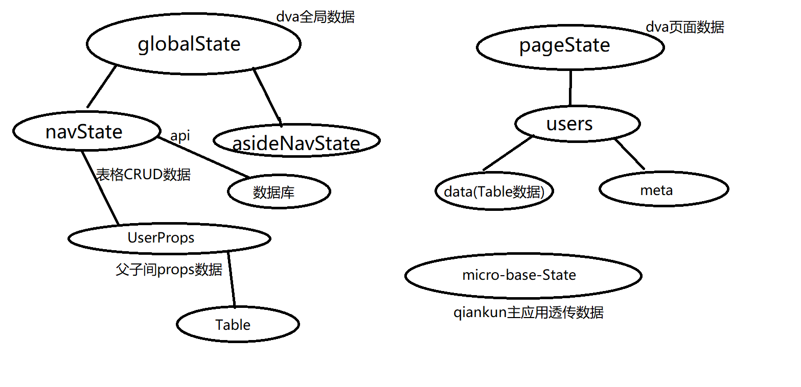

## Getting Started

Install dependencies,

```bash
$ yarn
```

Start the dev server,

```bash
$ yarn start
```

# 目录结构


# 数据流


# umi-qiankun使用要点
1. 主子应用全部都要安装一份umi-qiankun
2. 主应用配置，子应用配置，子应用要在package.json加上对应name
3. 子应用只要配置，路由不用改动，主应用当导航，用layout显示出子应用

# umi-qiankun存在问题
1. qiankun本地背景地址会失效，待解决
2. 使用qiankun会导致路径重复刷新多次，页面组件重新挂载多次，如果在8001则不会
3. qiankun中img会被加上display:block,8001则不会